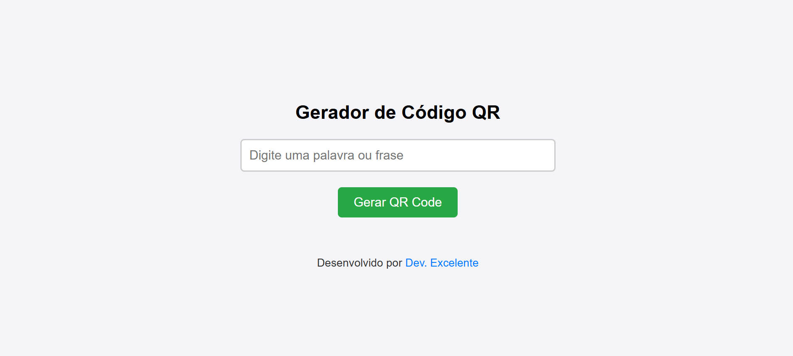

# 📱 Gerador de Código QR

Uma aplicação web que permite aos usuários gerar códigos QR a partir de uma palavra ou frase digitada.

## 📜 Descrição do Projeto

Este projeto oferece uma interface simples e intuitiva para a criação de códigos QR. O usuário pode inserir qualquer texto e, ao clicar no botão, um código QR correspondente será gerado e exibido na tela.

## 🚀 Tecnologias Utilizadas

- HTML
- CSS
- JavaScript
- QRCode.js (biblioteca para geração de códigos QR)

## 📁 Estrutura do Projeto

- `index.html` - Estrutura principal da aplicação.
- `styles.css` - Estilos da aplicação.
- `script.js` - Funcionalidades e lógica da aplicação.
- QRCode.js - Biblioteca externa utilizada para gerar códigos QR.

## 🎯 Funcionalidades

- 🖊️ Campo de entrada para digitar uma palavra ou frase.
- 🔲 Botão para gerar o código QR.
- 📊 Exibição do código QR gerado na tela.

### 📷 Demonstração

### 🔗 Link para o Projeto

👉 [Ver Projeto ao Vivo](https://maike-simoncini.github.io/Gerador-de-Codigo-QR/) 👈

### 📄 Licença

Este projeto é de código aberto e pode ser utilizado por qualquer pessoa.
